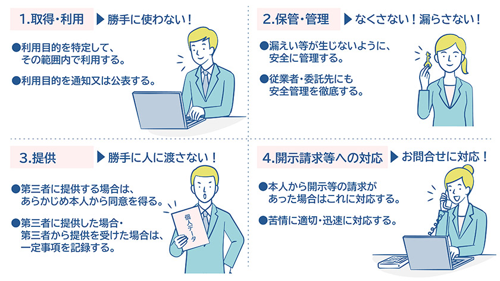

<!-- _paginate: false -->
# PTA ユーザ管理方法

どうする？連絡手段

<div class="author">
2022年11月5日<br/>
日野学園PTA IT担当
</div>

### 背景

<div class="small">
いままで、会員等関係者への連絡は学校が保有する情報を流用させてもらっていましたが、昨今の個人情報の取り扱いへの意識の高まりから安易に流用することができなくなりました。
</div>
<div class="small">
そこで流用できないことを前提とした運営が必要となりますが、連絡をなくすことができない業務がどうしても残るため、独自の連絡手段を確保する必要があります。
</div>



## 結論

メールアドレスだけ収集してメーリングリストを作成しましょう

### ポイントは

- 連絡は必要だけど学校の情報は利用できなくなった
  :arrow_right: 独自に連絡ルートを確保しましょう
- なるべく安全で負担の少ない集め方
- 集めたあとは・・・管理方法
- 個人情報の考察

```
この資料は、連絡手段としてメールアドレスを収集・管理する方法について検討したものです。
紙資料を配布する、などアナログな手段もありますが、ここでは考慮しません。
```


## なるべく安全で負担の少ない集め方

まずは、収集する際に問題となる点と解決策、その後、個人情報に配慮した収集方法について記載します。

### 問題点1 登録可否判断

- 連絡先を収集する際に、
  - 名簿がないため学校関係者・保護者であることがわかりません
  - そもそも名簿がないので連絡手段がありません。

  連絡先が集まったとして、この先いろいろな情報を連絡してもよい相手なのだろうか・・・？

### 対策1

(みなさんお気づきと思いますが・・)
- 学校経由で依頼しましょう
  :arrow_right: 学校から生徒を通じて保護者に届けてもらう

初回は学校の負担になりますが、ここだけは協力していただくしかない。


### 問題点2 本人確認

- 募集の連絡ができたとして、
  - 本当に関係者からの応募であることがわかるのか？
  - 応募した本人からの登録であることがわかるのか？

  連絡先が集まったとして、この先いろいろな情報を連絡してもよい相手なのだろうか・・・？(再)

### 対策2

__わからない！__:scream:・・・が緩和はできる

- 募集時にキーワードを掲載して登録時にマッチングする
- 応募時のメールアドレスに返信して本人確認(登録の意思確認)を行う

> ※ 以下のケースは救えない
> - 関係者が悪意を持って外部にもらす
>
> ※ 以下のケースは防げる
> - 部外者が自身のメールアドレスを登録する
> - 関係者が他人のメールアドレスを登録する

### 問題点3

さあ、連絡先も集まり、運用開始！ でも

- 集めたメールアドレスが漏洩しないか心配
- 登録に関する個別の問い合わせ(開示請求)に対応できるのか？


### 対策3 その1

- 漏洩対策
  - メールアドレスを管理するシステムを使用し、アドレス一覧へのアクセスを制限する

<div class="list">

  :arrow_right: 文字で書くとベタですが、集める以上やるしかない。が、初期設定をきちんとすれば大丈夫

</div>

### 対策3 その2

- 開示請求対策
  1. そもそもメーリングリストに必要な情報はメールアドレスのみのためメールアドレス以外は保有しない
  2. 保有情報はメールアドレスのみ、氏名とセットで保有しないので開示できる情報はない

  という姿勢で望む

### 補足

- これだけはやりたくない→やらない
  - 記録のために氏名とメールアドレスをセットで記録すること

## 収集方法

個人情報に配慮したメールアドレスの収集方法

### 前提

連絡したい対象をグループとして管理し連絡先を収集する
- PTA全体
- 部会
- 役員会 など



### 収集方法(運営側目線)

1. 学校経由でグループ登録の案内を配布する
2. 利用者側からのアクションを待つ
3. メールアドレスが仮登録されたら確認メールを送信する
4. 利用者のアクションにより本登録される


### 収集方法(利用者目線)

1. 学校経由でグループ登録の案内が来る
2. グループに所属したいと判断したら仮登録を行う
3. 登録したいメールアドレスに確認メールが届く
4. 確認メールを見て本登録を行う

※ よくあるフローですね

### 概念図


```※ メーリングリストに Google Groups を使用した場合```

### 収集・運用フロー


## 集めたあとは・・・

グループの適切な管理と廃棄

### グループの適切な管理と廃棄

ここまでで、メーリングリストができました。このあとは以下に対応する必要があります。

- 利用者の異動への対応

<div class="list">

※ 異動とは、関係者ではなくなることやグループへの参加意思の変化により退会や新規参加があること
</div>

<div class="list">

:arrow_right: まずは参加や脱退の手続きをしてもらいグループの登録内容を正しくメンテナンスする
</div>

### 問題点

- 適切に脱退手続きされない
  - 脱退の手続きを忘れていた
  - 参加資格がなくなったがあえて脱退しなかった

  :arrow_right: 連絡してはいけない人に連絡してしまう


### 対策

__わからない！__:scream:・・・が緩和はできる(再)

完全に把握し適切な状態に保つことは難しいが以下の方法で緩和する

- 年度単位でグループを作り変える
  面倒でも1年単位で再募集

<div class="list">

:arrow_right: 最長、年度末まで不要な連絡を送ってしまうが、新年度からは解消される

</div>

__グループの寿命は最長1年とし年度ごとに作り変えるルールとしましょう！__

> もっと短く作り直せば傷は小さくなる。が利用者側の負担も増える。

## まとめ

- メーリングリストをつくりましょう
  - 学校経由で案内し適切な方に募集をかける
  - なりすましできない方法でメールアドレスを収集する
  - メールアドレス一覧はアクセス制限をかけ漏洩を防ぐ
  - グループに寿命をもうけ手続き漏れを防ぐ


### 今回の成果

一方向・非同期(プッシュ型)のコミュニケーション手段を確立できました:tada:

|        | 同期 | 非同期(プッシュ型) | 非同期(プル型) |
| ------ | ---- | ------------------ | -------------- |
| 一方向 | ①    | ② :arrow_left:ココ | ③              |
| 双方向 | ④    | ⑤                  | ⑥              |

<div class="x-small">

代表的な手段
①: ライブ配信、講演
②: メール、紙資料配布
③: ポータルサイト、掲示板 (物理的なもの)
④: 電話、オンライン会議、対面会議
⑤: チャット、メール
⑥: 掲示板 (電子的なもの & 主催者以外も書き込めるもの)

</div>


## 個人情報の考察

> 参考
> - 政府広報オンライン
>   [「個人情報保護法」をわかりやすく解説　個人情報の取扱いルールとは？](https://www.gov-online.go.jp/useful/article/201703/1.html)


### 個人情報って？

[個人情報の保護に関する法律](https://elaws.e-gov.go.jp/document?lawid=415AC0000000057)では以下のように記載されています。

- 個人を特定できる情報

> 法第2条（第1項）
> 『生存する個人に関する情報であって、当該情報に含まれる氏名、生年月日その他の記述などによって特定の個人を識別できるもの（他の情報と容易に照合することができ、それによって特定の個人を識別することができることとなるものを含む。）、または個人識別符号が含まれるもの。』
> 
> https://elaws.e-gov.go.jp/document?lawid=415AC0000000057


ではメールアドレス単体なら？

### メールアドレス単体の場合

- フリーメールは個人情報に該当しない
- 独自ドメインのメールアドレスは要注意

>
> [個人情報保護委員会](https://www.ppc.go.jp/)
> 
> Ｑ１－４ メールアドレスだけでも個人情報に該当しますか。
> Ａ１－４ メールアドレスのユーザー名及びドメイン名から特定の個人を識別することができる場合（例：kojin_ichiro@example.com）、当該メールアドレスは、それ自体が単独で、個人情報に該当します。
> これ以外の場合、個別の事例ごとに判断することになりますが、他の情報と容易に照合することにより特定の個人を識別することができる場合、当該情報とあわせて全体として個人情報に該当することがあります。
> 
> https://www.ppc.go.jp/all_faq_index/faq1-q1-4/
> 

### ということで

メールアドレス単体だけならなんとかなりそう。

```
〜言い訳〜
なんとかなる。というのは、
管理は必要であるが、そこまで神経質にならなくても、
また、提供する側もそこまで敏感にならずに提供してくれる
という範囲ではないか、と考えられる、こと。
```

#### 基本姿勢

- 不要な個人情報は保有しない
  - メールアドレス単体のみとする

### さらに・・・

個人情報にあたらないとはいえ、グレーなものも含まれるし流出するのは避けたいよね。
:arrow_right:では ___メーリングリスト___ で

- 連絡する際に個別のアドレスを知っている必要はない
- ひとつの宛先を記入するだけでグループ全員に通知される
  - 何百というアドレスを手で入力する必要がない
- 受信者には他の方のメールアドレスが見えない
  - BCC指定忘れ問題解決

### 連絡時の考慮点
  - 個人を特定する情報を使用せず連絡できること
    :arrow_right: :o:メーリングリスト

#### だめなもの
これらは個別の宛先が見えてしまう

- :x:チャット
- :x:宛先を複数指定したメール


## おまけ

### 今回の検討で以下の力を手に入れた:arrow_heading_up:

- 連絡手段
  - メールにより早く伝達できる
- 各種リソースへのアクセス制御手段(※)
  - ホームページ
  - フォルダ 等
  - アクセス制御により安全に提供できる

```※ アカウントがあるとついでにできる```


### この資料で扱った内容

- 連絡やアクセス制御のために使用するメールアドレスの収集から廃棄までの手段・運用について
- 対象となる集団の構成員を認識せずに連絡できる方法
 
### 扱っていない内容

- 連絡やアクセス制御を行いたい集団自体の名簿作成や属性情報の管理
- 会員名簿の作成や管理

### 補足:
  - 入会届と直接にはリンクしない
  - 入会届と同時に処理すればPTA会員集合としてのメールアドレス一覧を作成できる
  - xxxxイベント用として案内して処理すればxxxxイベントの連絡先集合としてのメールアドレス一覧を作成できる

### 会員減少対策

- 登録を任意にすると
  - 登録率があがらない
    - インセンティブが必要

インセンティブの実現に今回手に入れた力を利用できるのでは？

### ご注意

この資料にて参照している情報は資料作成時点で得られた情報をもとにしています。法改正、解釈の変更または誤りの訂正などによりリンク先の情報が更新され当資料の内容と合致しなくなる可能性があります。
今回検討した内容は時勢に合わせて適宜見直してください。

2022年11月5日